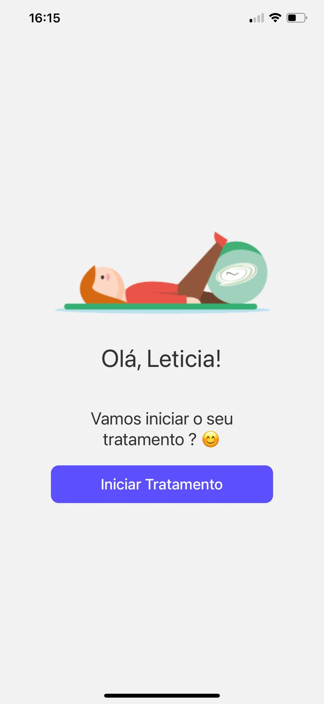
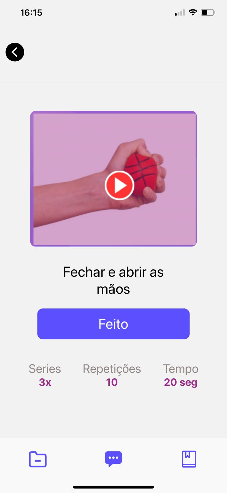

# FisioApp
FisioTherapp Ajude pacientes com exercícios de fisioterapia!
DevChallenge

> Tecnologias utilizadas:
React Native

### Ajustes e melhorias

## 🤝 Autor

Agradecemos às seguintes pessoas que contribuíram para este projeto:

<table>
  <tr>
    <td align="center">
      <a href="#">
         
        
          <b>Vinicius de Morais</b>
        
      </a>
    </td>
    <td align="center">
      <a href="#">
         
        
          <b>Lorena GM</b>
        
      </a>
    </td>
  </tr>
</table>

## 📝 Licença

Esse projeto está sob licença. Veja o arquivo [LICENÇA](LICENSE.md) para mais detalhes.

[⬆ Voltar ao topo](#nome-do-projeto) 
